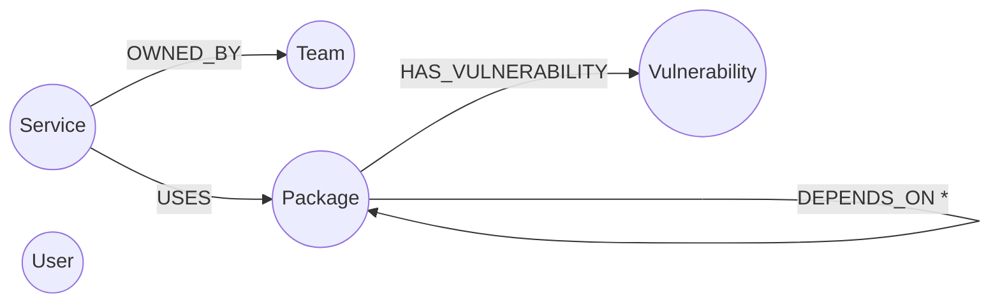
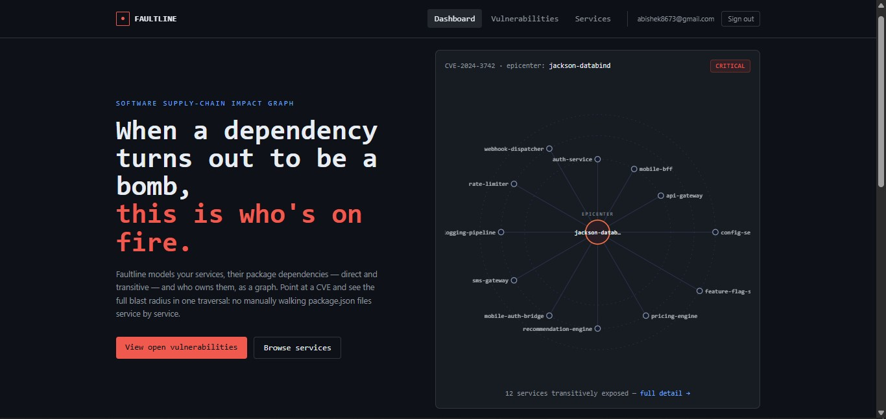
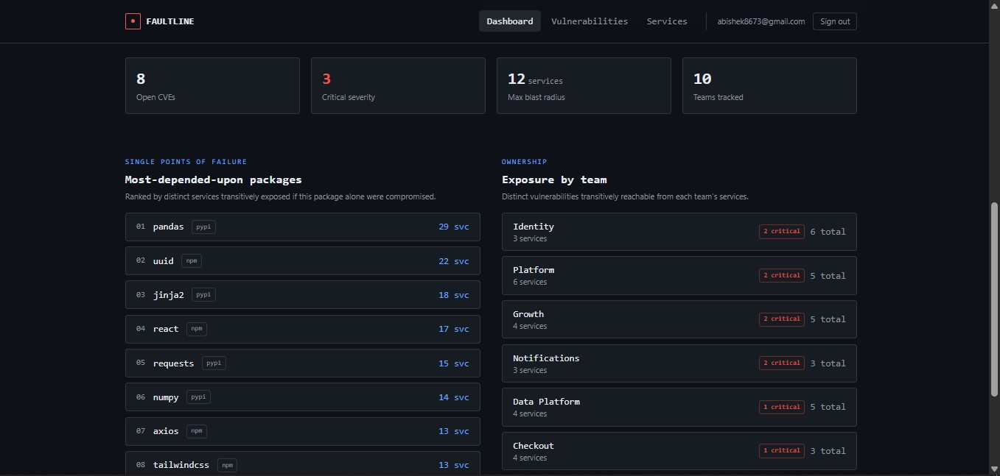
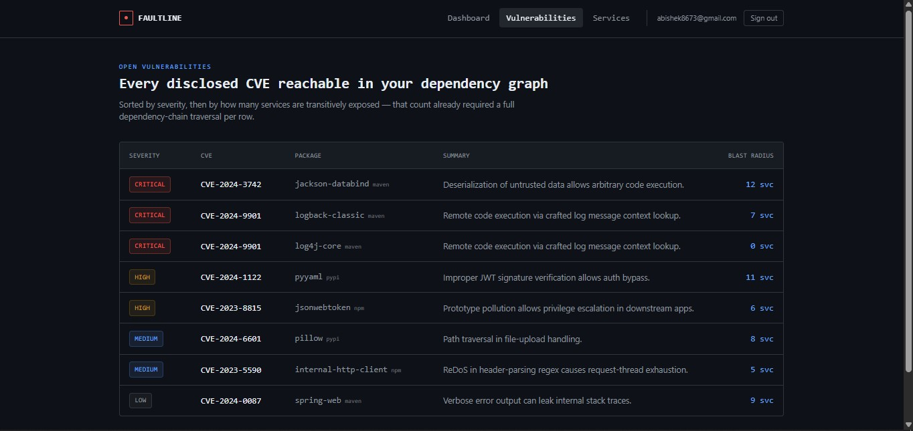
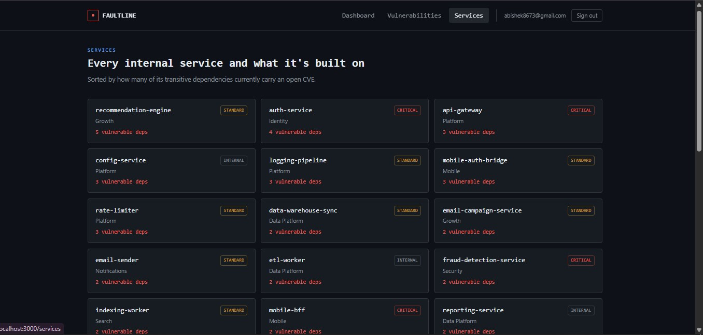
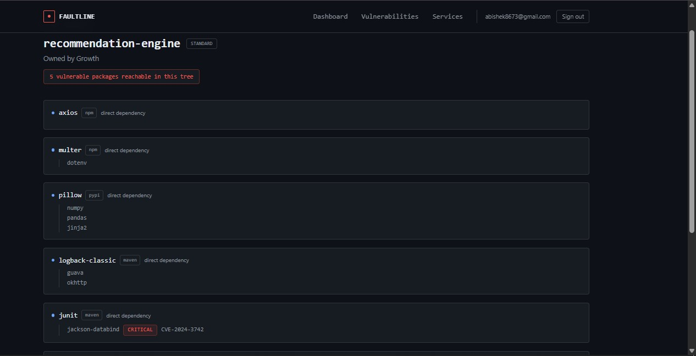
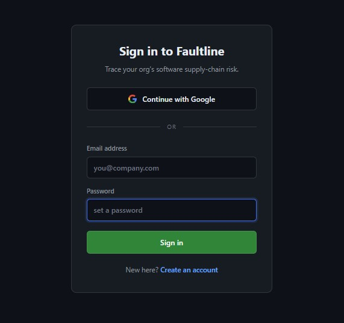

# Faultline

A software supply-chain "blast radius" explorer, built on **CognoDB** (a graph database).

## What it does

Software services depend on packages, which depend on other packages, several layers deep. When a security vulnerability (CVE) is disclosed in one of those packages, Faultline instantly shows:

- which internal services are affected, no matter how many dependency layers deep
- which teams own those services, so you know who to notify
- the exact dependency chain connecting any service to the vulnerable package
- which packages are "single points of failure" - the ones that would affect the most services if compromised

## Data model

- **Package** → **Package**: `DEPENDS_ON` — one link in a dependency chain, can be walked any number of hops
- **Service** → **Package**: `USES` — a service's direct dependency
- **Service** → **Team**: `OWNED_BY` — who to notify
- **Package** → **Vulnerability**: `HAS_VULNERABILITY` - a disclosed CVE on that package

## Why a graph database

Answering "what's affected" requires walking a dependency chain of unknown depth - a natural fit for a graph database's traversal queries, and an awkward one for a relational database's fixed-depth joins.

## Stack

- **Backend:** Flask + Python, connected to CognoDB via the Neo4j driver
- **Frontend:** Next.js + Tailwind CSS
- **Auth:** email/password + Google sign-in (NextAuth)
- **Database:** CognoDB (graph database, openCypher over Bolt)

## Screenshots

*Dashboard - live blast-radius diagram, critical packages, team exposure*

*Most-depended-upon packages*

*Every disclosed CVE reachable in your dependency graph*

*A service's full dependency tree, vulnerable packages flagged*

*recommendation-engine*

*Email/password and Google sign-in*

## Setup

1. Create a free CognoDB instance at [console.cognodb.com](https://console.cognodb.com/signup)
2. Backend: `cd backend`, `pip install -r requirements.txt`, copy `.env.example` to `.env` and add your CognoDB credentials, then `python seed/seed.py` and `python app.py`
3. Frontend: `cd frontend`, `npm install`, copy `.env.local.example` to `.env.local` and fill it in, then `npm run dev`

