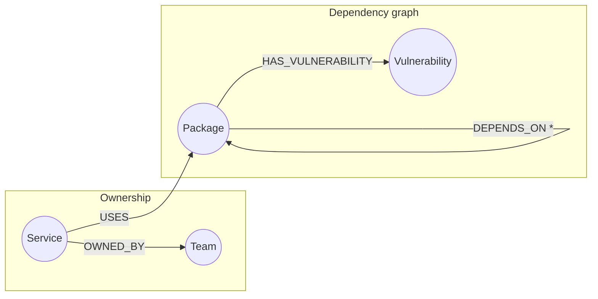

# Faultline

**"A CVE just dropped in a package we depend on somewhere. What's on fire, and who do I page?"**

Faultline is a software-supply-chain blast-radius explorer. It models an
engineering org — packages, their transitive dependency chains, the internal
services that use them, and the teams that own those services — as a graph
in **CognoDB**, and lets anyone answer that question in seconds instead of
grepping through `package.json` / `requirements.txt` / `pom.xml` files
service by service.

Point Faultline at a disclosed vulnerability and it shows:

- every service transitively exposed, no matter how many dependency hops deep
- which team owns each exposed service, so you know who to notify
- the exact dependency chain from any one service down to the vulnerable package
- which packages in your org are single points of failure — the ones that,
  if compromised, would take out the most services

This was built for the Wexa AI "Build a Graph Database Application"
take-home assignment, using CognoDB as the graph database layer.

---

## Why a graph database?

The central question — *"if package X is compromised, what's affected?"*
— is a **transitive-closure question over a chain of unknown, variable
depth.** A service might use a package directly, or three, four, five levels
removed through a chain of internal SDKs and third-party libraries. Real
incidents (log4j/Log4Shell being the canonical example) are exactly this:
the vulnerable artifact is buried several `DEPENDS_ON` hops below anything a
team owns directly.

In a relational schema this means:

- a `package_dependencies(parent_id, child_id)` self-referencing table,
- walked with a **recursive CTE** per query, since the depth isn't fixed,
- with manual de-duplication once the dependency graph has diamonds (two
  packages independently depending on the same third package — extremely
  common in real registries), and
- a *second* recursive traversal, or a big join, to connect the resulting
  package set back to services and then to teams.

That's three non-trivial, easy-to-get-subtly-wrong queries chained together,
re-implemented by hand every time the question changes shape slightly
("now do it for services only", "now weight by severity", "now find the
shortest path instead of all paths").

In CognoDB, the same question is one openCypher pattern:

```cypher
MATCH (dependent:Package)-[:DEPENDS_ON*0..6]->(vulnerable:Package)
```

Variable-length path matching, shortest-path search, and pattern-based
traversal are native primitives — not something bolted on with recursive
SQL. The "single point of failure" ranking (which packages have the largest
blast radius) and the "shortest explanation path" from a service down to a
CVE are the kind of centrality/pathfinding questions graphs are built for
and relational databases are not.

---

## Data model



| Node             | Key properties                          |
| ---------------- | ---------------------------------------- |
| `Package`        | `id`, `name`, `ecosystem` (npm/pypi/maven), `version` |
| `Service`        | `id`, `name`, `tier` (critical/standard/internal) |
| `Team`            | `id`, `name` |
| `Vulnerability`  | `id`, `cve`, `severity`, `summary`, `published` |

| Relationship             | Direction                        | Meaning |
| ------------------------ | --------------------------------- | ------- |
| `(:Package)-[:DEPENDS_ON]->(:Package)` | dependent → dependency | one hop of a transitive dependency chain |
| `(:Service)-[:USES]->(:Package)`       | service → direct dependency | a service's declared, direct dependency |
| `(:Service)-[:OWNED_BY]->(:Team)`      | service → owning team | on-call / notification routing |
| `(:Package)-[:HAS_VULNERABILITY]->(:Vulnerability)` | package → CVE | a disclosed vulnerability in that exact package |

The seed data (`backend/seed/generate_data.py`) builds a realistic,
layered dependency graph: ~25 foundational libraries (lodash, express,
log4j-core, requests, spring-web, …), a middle layer of libraries that
depend on those, and a top layer of internal SDKs that wrap the middle
layer — then 35 internal services attach to that graph, owned across 10
teams, with 8 CVEs seeded at varying depths so the demo shows genuinely
different blast radii.

---

## Project structure

```
wexa-depgraph/
├── backend/                 Flask API
│   ├── app.py                REST routes, error handling
│   ├── db.py                 Neo4j driver singleton + connection error handling
│   ├── queries.py             every Cypher query, documented
│   ├── seed/
│   │   ├── generate_data.py  builds seed/data.json (deterministic, seeded)
│   │   └── seed.py           loads data.json into CognoDB (idempotent)
│   ├── requirements.txt
│   └── .env.example
└── frontend/                 Next.js (App Router) + Tailwind CSS
    ├── src/app/               pages (dashboard, vulnerabilities, services)
    ├── src/components/        BlastRadiusDiagram (the radial visualization), Nav, badges, state banners
    ├── src/lib/api.ts         typed fetch client
    └── .env.local.example
```

---

## Setup

### 1. Create the CognoDB instance

1. Sign up at [console.cognodb.com/signup](https://console.cognodb.com/signup) (no credit card needed for the free tier).
2. Create a free **c0** instance, pick a region. Provisioning takes under a minute.
3. Copy the connection URI (`bolt+s://<instance-id>.databases.cognodb.cloud`) and the generated password for user `cognodb` — **the password is shown once**, save it immediately.

### 2. Backend

```bash
cd backend
python -m venv venv && source venv/bin/activate   # optional but recommended
pip install -r requirements.txt

cp .env.example .env
# edit .env: set NEO4J_URI and NEO4J_PASSWORD to the values from step 1

python seed/generate_data.py   # (re)builds seed/data.json — already included, but reproducible
python seed/seed.py            # loads it into CognoDB — safe to re-run, uses MERGE throughout

python app.py                  # serves the API on http://localhost:5001
```

### 3. Frontend

```bash
cd frontend
npm install
cp .env.local.example .env.local   # points NEXT_PUBLIC_API_URL at the Flask API
npm run dev                        # http://localhost:3000
```

Open `http://localhost:3000`. If the API or CognoDB is unreachable, every
page shows an explicit "connection failed" state rather than a blank screen
or a stack trace.

---

## The main queries, explained

All queries live in `backend/queries.py`, are parameterised (no string
concatenation — see `db.run_query`), and are called from the routes in
`backend/app.py`.

**`vulnerability_blast_radius(vuln_id)`** — the core query. Starting at the
vulnerable package, walks `DEPENDS_ON` **backwards** through 0–6 hops to
find every package that pulls it in, then fans out to the services that use
any of those packages and the teams that own them. One query, no fixed
depth, no manual de-duplication.

**`shortest_path_to_vulnerability(service_id, vuln_id)`** — `shortestPath()`
over a mixed `USES`/`DEPENDS_ON` pattern, so the UI can show *why* a given
service is exposed (the exact chain), not just *that* it is.

**`critical_packages()`** — for every package, counts the distinct services
transitively exposed through it, and ranks descending. This is how the
dashboard surfaces single points of failure — packages that, unlike most,
sit underneath a huge share of the org's services.

**`team_exposure()`** — aggregates, per team, how many distinct
vulnerabilities are transitively reachable from that team's services,
split out by severity.

**`service_dependency_tree(service_id)`** — the full tree for one service:
every direct dependency, and everything transitively under each one, with
vulnerable packages flagged in place.

---

## Deployment

- **Backend**: any Python host that can hold two env vars (Render, Railway,
  Fly.io, a small VM). Start command: `gunicorn app:app` (add `gunicorn` to
  `requirements.txt` if your host expects a WSGI entrypoint rather than
  `python app.py`).
- **Frontend**: Vercel is the path of least resistance for Next.js — set
  `NEXT_PUBLIC_API_URL` to the deployed backend URL as an environment
  variable in the project settings.

*(Hosted demo link and screen recording: see submission email — add yours
here before pushing if you deploy it.)*

## Screenshots

*(Add screenshots of the running app here — dashboard, a blast-radius
detail page, and a service dependency tree — once you have real data
loaded from your own CognoDB instance.)*

---

## Notes on engineering choices

- **Error handling**: `db.py` wraps every connectivity failure in a single
  `DatabaseUnavailableError`, caught once in `app.py` and turned into a
  clean `503` with a message — never a raw stack trace. The frontend's
  `ApiError` mirrors this so every page can show a real "connection
  failed" state instead of crashing.
- **No string-built Cypher**: every query takes parameters through the
  driver's `$param` binding (see any function in `queries.py` + how
  `db.run_query` passes `params` straight to `tx.run`). The one thing that
  *is* string-interpolated is the hop-count bound (`*0..6`) — Cypher
  requires that as a literal in the pattern, and it's a fixed internal
  constant (`MAX_HOPS`), never user input.
- **Idempotent seeding**: `seed.py` uses `MERGE` throughout, so re-running
  it after changing `generate_data.py` won't create duplicates.
